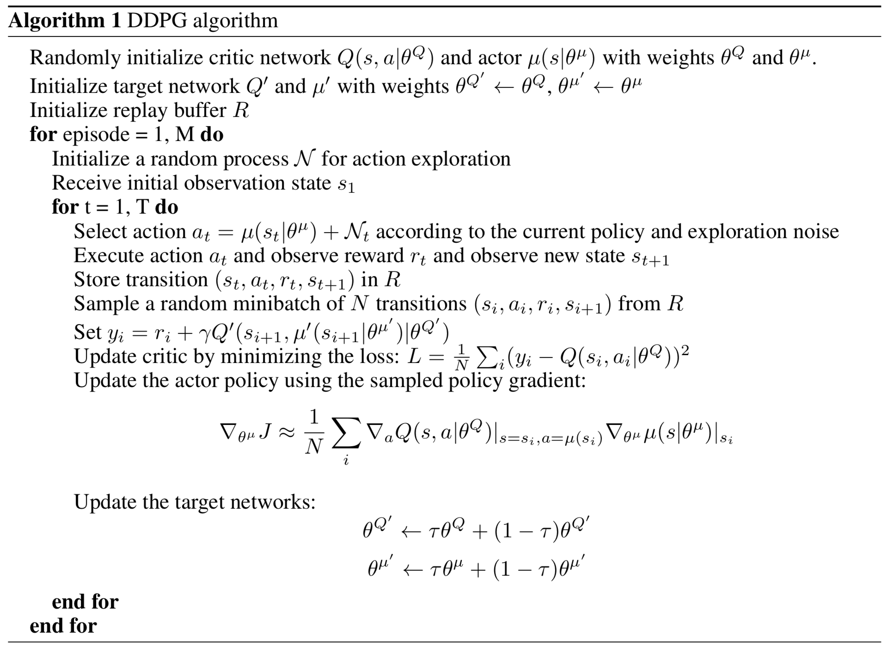
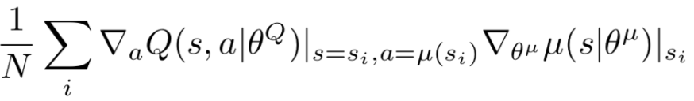
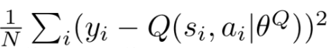
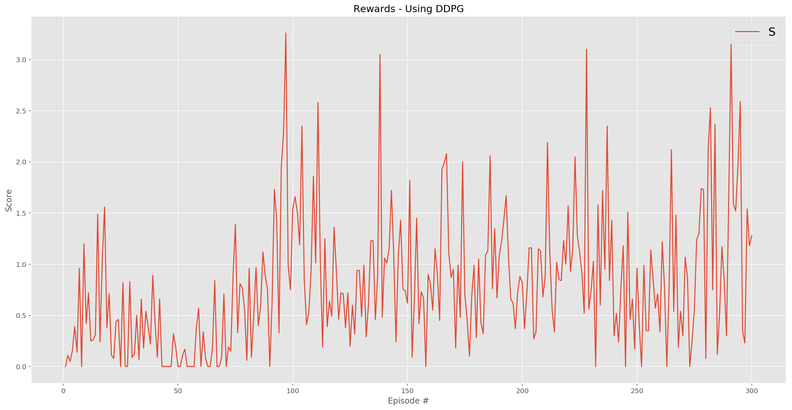
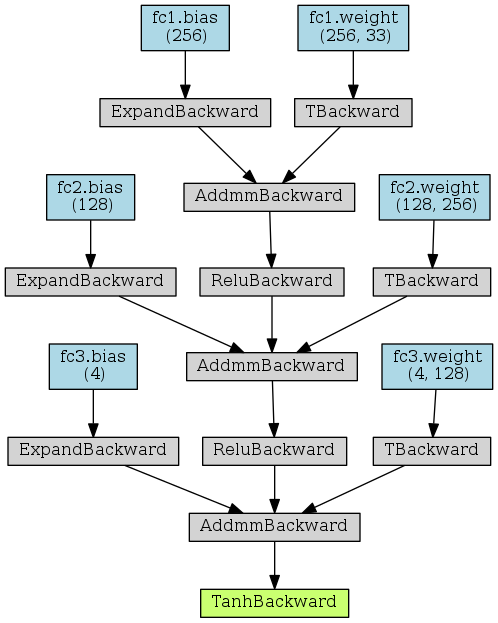
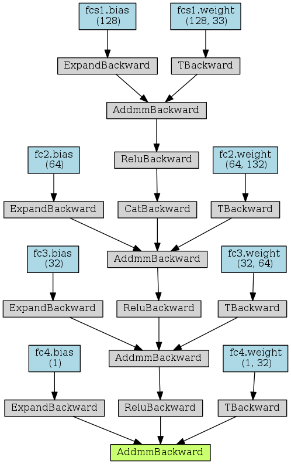

# Deep Reinforcement Learning: Continuous Control (Report)

[](https://twitter.com/youldash)

## License

By using this site, you agree to the **Terms of Use** that are defined in [LICENSE](https://github.com/youldash/DRL-Continuous-Control/blob/master/LICENSE).

## Algorithm Implementation

As mentioned in the [`README.md`](https://github.com/youldash/DRL-Continuous-Control/blob/master/README.md) file of this repo, The project was developed in partial fulfillment of the requirements for Udacity's [Deep Reinforcement Learning (DRL) Nanodegree](https://www.udacity.com/course/deep-reinforcement-learning-nanodegree--nd893) program. To solve the challenges presented therein, we explored (and implemented) the [Deep Deterministic Policy Gradient (DDPG)](https://spinningup.openai.com/en/latest/algorithms/ddpg.html) algorithm. This choice is motivated by the fact that the action space is continuous, and the DDPG algorithm has shown quite an impressive performance in past.

## The Deep Deterministic Policy Gradient Algorithm

Initial attempts were made for developing an `agent` implementation of the **DDPG** algorithm (see `agent.py` for details). The algorithm is summarized below:

[ddpg]: misc/algorithm.png "Deep Deterministic Policy Gradient (DDPG)."

<div align="center">
	
</div>

The DDPG agent employs the following two critical components to operate:

1. An **Actor** network (see `actor.py` for details).
2. A **Critic** network (see `critic.py` for details).

### The Actor

An **Actor**, based on the above **DDPG** pseudocode listing, uses an [Artificial Neural Network (ANN)](https://en.wikipedia.org/wiki/Artificial_neural_network) for deterministic policy approximations as `state -> argmax_Q` mappings with the following *loss minimization* function:

[ddpg actor loss]: misc/DDPGActorLoss.png "Actor loss function."

<div align="center">
	
</div>

### The Critic

Like an **Actor**, a **Critic** also uses an ANN for `Q-value` function approximations as `state -> action` mappings with the following *loss minimization* function:

[ddpg critoc loss]: misc/DDPGCriticLoss.png "Critic loss function."

<div align="center">
	
</div>

### Added Noise

The **DDPG** algorithm implementation also incorporates a sample of the [Ornstein–Uhlenbeck stochastic process](https://en.wikipedia.org/wiki/Ornstein–Uhlenbeck_process). See `noise.py` implementation details, and on the previous link for a detailed mathematical description on the process.

## Alternatives to Deep Deterministic Policy Gradients

> The [Proximal Policy Optimization (PPO)](https://medium.com/@jonathan_hui/rl-proximal-policy-optimization-ppo-explained-77f014ec3f12) algorithm (see [this paper](https://arxiv.org/abs/1707.06347)) is a good alternative to solving the environment using DDPG. According to the [published benchmarks](https://arxiv.org/pdf/1604.06778.pdf), the PPO strategy also shows better results in continuous control tasks. 

Perhaps, with the possibility of reaching better outcomes in the future, further implementations using this strategy might well be included this repository (for public benefit).

## Early Attempts

- Numerous attempts were made to improve the results obtained from training the networks. All ended with no favorable outcomes, thus losing precious GPU time when using the Udacity workspace. Our attempts were based on [choosing 20 agents and training them for solving the environment](https://github.com/youldash/DRL-Continuous-Control#version-2-twenty-20-agents). See the following figure (plot) for a failed attempt (*i.e.* the agents didn't reach the targeted average score of `+30` over `100` consecutive episodes, and over all agents):

[attempt]: plot/Attempt.png "Failed attempt."

<div align="center">
	
</div>

- Our best training configuration is reported herein. A **DDPG** `agent` configuration solved the virtual world (or environment) in a good number of episodes. This was set as a point of reference to beat in our future attempts. The `agent`'s architecture was adjusted based on the following [Neural Network (NN)](https://pathmind.com/wiki/neural-network) configurations:

### The Actor Model (Architecture)

As mentioned above, an `actor` builds an Actor (Policy) NN that maps `states -> actions`. Further, it (*i.e.* the `model`) is comprised of the following:

- The `actor` has `3` **Fully-connected (FC)** layers.
- The **first FC** layer takes in the **state**, and passes it through `256` nodes with `relu` activation.
- The **second FC** layer take the output from previous layer, and passes it through `128` nodes with `relu` activation.
- The **third PC** layer takes the output from the previous layer, and outputs the `action size` with `tanh` activation.
- The model utilizes an `Adam` optimizer for enhancing the performance of the model.

The following figure summarizes the `actor` architecture in detail. The plot was generated using the preinstalled [torchviz](https://www.google.com/url?sa=t&rct=j&q=&esrc=s&source=web&cd=&cad=rja&uact=8&ved=2ahUKEwjDou73gOvpAhWFxoUKHenVBKAQFjAAegQIARAB&url=https%3A%2F%2Fpypi.org%2Fproject%2Ftorchviz%2F&usg=AOvVaw0mFjGWq6fnUjTbmf8EAK5Y) Python package:

[actor]: plot/Actor.png "Actor."

<div align="center">
	
</div>

### The Critic Model (Architecture)

The `critic` model, as mentioned above, builds a Critic (Value) NN that maps `(state, action)` pairs `-> Q-values`. The network is made up of the following:

- The `critic` has `4` **(FC)** layers.
- The **first FC** layer takes in the **state**, and passes it through `128` nodes with `relu` activation.
- The output from this layer is then taken, and then concatenated with the **action size**.
- The **second FC** layer take the concatenated output, and passes it through `64` nodes with `relu` activation.
- The **third PC** layer takes the output from the previous layer, and passes it through `32` nodes with `relu` activation.
- The **fourth PC** layer then finally takes the output from the previous layer and outputs `1` node.
- Similar to the `actor`, this model utilizes an `Adam` optimizer for enhancing the performance.

The following figure summarizes the `critic` architecture in detail. The plot was generated using the preinstalled [torchviz](https://www.google.com/url?sa=t&rct=j&q=&esrc=s&source=web&cd=&cad=rja&uact=8&ved=2ahUKEwjDou73gOvpAhWFxoUKHenVBKAQFjAAegQIARAB&url=https%3A%2F%2Fpypi.org%2Fproject%2Ftorchviz%2F&usg=AOvVaw0mFjGWq6fnUjTbmf8EAK5Y) Python package:

[critic]: plot/Actor.png "Critic."

<div align="center">
	
</div>


- Further attempts were made by amending the `model` architecture (*i.e.* by increasing the number of layers, as well as increasing the number of nodes in the `model`). These experiments yielded **poorer** results when compared to the **benchmark** configuration above, leading us to further adjust the `model` by having **two FC layers (having 128 nodes in the first, and 32 nodes in the second)**. This architecture solved the environment in less than 500 episodes. This architecture is summarized as the following:
```
Input nodes (37) -> FC Layer (128 nodes, ReLU activation) -> FC Layer (32 nodes, ReLU activation) -> Output nodes (4)
```
> At this point it is imperative to note that this particular `model` configuration was considered as the foundation to be used in our future tests of the agent (for further comparisons), since the results looked promising. See the [`NavigationUsingDQN.ipynb`](https://github.com/youldash/DRL-Continuous-Control/blob/master/NavigationUsingDQN.ipynb) notebook for implementation details and the rewards (*i.e.* the results) obtained after training and testing.


- Using the **benchmark** `model` configuration, we strived to achieve better results that those obtained by the previous attempts. As a result, we achieved outcomes that are considered better than the attempts made by the previous **DN** implementation (yet not better than the plain-vanilla **DQN** approach in terms of the number of episodes noted).

- In the [`NavigationUsingDoubleDQNWithDuelingNetwork.ipynb`](https://github.com/youldash/DRL-Continuous-Control/blob/master/NavigationUsingDoubleDQNWithDuelingNetwork.ipynb) notebook file you can see that there are three flags that can be toggled (on or off). The following snippet depicts these three variables:

``` Python
""" Global configuration.
"""
TOGGLE_DOUBLE_DQN = True            # True for the Double-DQN method. False for the fixed Q-target method.
TOGGLE_DUELING_NETWORK = True       # True for the Dueling Network (DN) method.
TOGGLE_PRIORITIZED_REPLAY = False   # True for the Prioritized Replay memory buffer.
```


## Parameter Tuning

In all of our experiments a set of tuning parameters (or rather **hyperparameters**) enabled us to explore the possible variations possible for achieving the results (both reported here, and others expected in future tuning attempts). Ideally, it is worthy to mention that one single hyperparameter configuration might work with one `model`, and may well **NOT** be suitable with others.

### Notebook Parameters

In all the Jupyter notebooks of this repo you may tweak the following parameters:

``` Python
def dqn(n_episodes=2e3, max_t=int(1e3), eps_start=1., eps_end=1e-2, eps_decay=995e-3):
    """ Implementation of the Deep Q-Network (DQN) algorithm.
    
    Params
    ======
        n_episodes (int): Maximum number of training episodes
        max_t (int): Maximum number of timesteps per episode
        eps_start (float): Starting value of epsilon (ε), for epsilon-greedy action selection
        eps_end (float): Minimum value of epsilon (ε)
        eps_decay (float): Multiplicative factor (per episode) for decreasing epsilon
    """
```

In addition to the above parameters the following parameter segments are also adjustable (see the `agent.py` Python script for details):

``` Python
""" Hyperparameter setup.
"""
BUFFER_SIZE = int(1e5)  # Replay buffer size.
BATCH_SIZE = 64         # Minibatch size.
LEARNING_RATE = 4.8e-4  # Learning rate.
THRESHOLD = 4           # How often to update the network.
GAMMA = 99e-2           # Discount factor.
TAU = 1e-2              # For soft update of target parameters.
```

``` Python
double_dqn = False
""" True for the Double-DQN method.
"""

dueling_network = False
""" True for the Dueling Network (DN) method.
"""

prioritized_replay = False
""" True for the Prioritized Replay memory buffer.
"""
```

``` Python
def __init__(
    self, state_size, action_size, seed, lr_decay=9999e-4,
    double_dqn=False, dueling_network=False, prioritized_replay=False):
    """ Initialize an Agent instance.
    
    Params
    ======
        state_size (int): Dimension of each state
        action_size (int): Dimension of each action
        seed (int): Random seed
        lr_decay (float): Multiplicative factor of learning rate decay
        double_dqn (bool): Toogle for using the Double-DQN method
        dueling_network (bool): Toogle for using the Dueling Network (DN) method
        prioritized_replay (bool): Toogle for using the Prioritized Replay method
    """
```


### Rewards Plot

The following graph illustrated the outcomes:


The trained agent, as witnesses in the accompanying   [`NavigationUsingDoubleDQNWithDuelingNetwork.ipynb`](https://github.com/youldash/DRL-Continuous-Control/blob/master/NavigationUsingDoubleDQNWithDuelingNetwork.ipynb) notebook file, revealed the following results:

```
EPISODE 100	AVG SCORE: 10.3200	EPS: 0.0270	LEARNING RATE: [0.00022711322607504007]
EPISODE 158	AVG SCORE: 13.0600	EPS: 0.0128	LEARNING RATE: [0.00014699916918461692]

Environment solved in 58 episodes.
Average score: 13.06.
Model saved successfully.

Solved in 4.06 minutes.
```

Although the environment was solved in lesser time as we compared it against the plain **DN** approach, the number of episodes reached were a little higher than the **benchmark** `model` configuration.


## Conclusion and Future Work

This report presented out work in training an agent to solve the environment, while considering varying architectures to determine which `model` configuration would be deemed the best in our experiments. In all attempts the results shown in the [first part](https://github.com/youldash/DRL-Continuous-Control/blob/master/REPORT.md#the-deep-q-network-algorithm) set the benchmark for future attempts. 

The work presented herein was made possible using Udacity's [NVIDIA Tesla K80 accelerator GPU](https://www.nvidia.com/en-gb/data-center/tesla-k80/) architecture. In future works we plan on implementing (and training all agents) locally using NVIDIA GPUs (both internally, and externally mounted using eGPU enclosures).

Although the [Prioritized Experience Replay](https://arxiv.org/abs/1511.05952) memory buffer algorithm was mentioned above, we did not fully test its implementation and made this a possible "future work" attempt.
 
With the possibility of reaching better outcomes by tweaking the parameters a bit (as seen above), perhaps it it noteworthy to include other state-of-the-art algorithm implementations and compare them against our **benchmark**. These of which include (and are not limited to) the following:

* [Distributional-DQNs](https://arxiv.org/abs/1707.06887) by Marc G. Bellemare, Will Dabney, and Rémi Munos.
* [Noisy Networks](https://arxiv.org/abs/1706.10295) by Meire Fortunato, Mohammad Gheshlaghi Azar, Bilal Piot, Jacob Menick, Ian Osband, Alex Graves, Vlad Mnih, Remi Munos, Demis Hassabis, Olivier Pietquin, Charles Blundell, and Shane Legg.
* [Asynchronous Methods for DRL](https://arxiv.org/abs/1602.01783) by Volodymyr Mnih, Adrià Puigdomènech Badia, Mehdi Mirza, Alex Graves, Timothy P. Lillicrap, Tim Harley, David Silver, and Koray Kavukcuoglu.
* And others...
